# crappy estimates of a generic SINoALICE banner cost

## Summary

| Roll No. | No. of 10 Rolls | Min Spend (£) | Total | Mean Rolls | Median Rolls |
|---|---|---|---|---|
| 1 | 2 | 47.98 | 2 | | |
| 2 | 1 | 23.99 | 3 | | |
| 3 | 10 | 202.95 | 13 | | |
| 4 | 5 | 109.98 | 18 | | |
| 5 | 4 | 78.98 | 22 | | |
| 6 | 3 | 64.97 | 25 | | |
| 7 | 3 | 64.97 | 28 | | |
| 8 | 11 | 224.96 | 39 | | |
| 9 | 1 | 23.99 | 40 | | |
| 10 | 11 | 224.96 | 51 | 5.1 (1530💎) | 4 (1200💎)|
| | |  | | **Mean Cost** (£) | **Median Cost** (£) |
| |  | | | **106.77** | **78.98** |
💎 = Twilight Crystals 
_(Rounded to 4 places on chart; calculated from 10 places)_

## Discussion

I was inspired by [this thread](https://twitter.com/skc_kdawg/status/1539838792604991488?t=8xI_m4wQ0zggZCH9mSTDIQ), that tested various other gatcha game values on 10 rolls of a summoning simulator.

> To anyone who still supports Blizzard and thinks Diablo Immortal is okay, I ran these gacha games through simulators to see how much it would cost to get a 5-star character (or 6-star in the case of Arknights) and I did it 10 times each.  
This is not okay. https://t.co/4KQx7iSr32

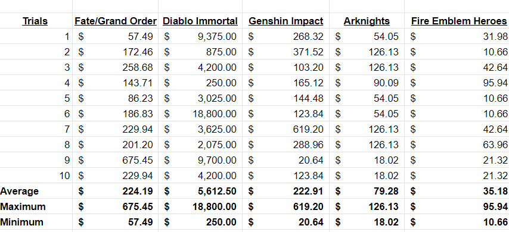

> I know proper sampling should be more than 10 times, but I don't feel like spending an entire week to do hundreds of tests.

> Also to any gacha fans that read this. Don't feel bad spending money on your favorite games as long as you aren't breaking bank or neglecting needs for jpegs, but do feel bad if the gacha you're spending it on is Diablo Immortal.

That made me curious to see how SINoALICE looked. A lot better than Diablo Immortal, but that was obvious. I just wanted a vague approximation of where it stood compared to other games.

As they said, this is a very small sample size, but uhhh I wrote up this whole damn document for a reason. You can do exactly the same thing I did, and improve the results yourself. Someone who actually understood statistics would surely be better at this than me. I simply refuse to learn Ruby.

These values vary considerably across currencies and will need to be recalculated entirely.

Values correct as of 26/06/2022 in the UK on Android.

## Methodology

### Figures 

To get a best approximation of each probability, I worked with the numbers we have: the figures provided in the banner. All of this data is available in the Referenced game information section.

| Item | No. of Types | Rate (%) | Total (%) |
|---|---|---|---|
| Featured SR | 3 | 0.666  | 1.998 |
| SR | 132 | 0.007 | 0.924 |
| S | 124 | 0.161 | 19.964
| A | 48 | 1.604 | 76.992 |
| Total | | | 99.878 |
_Pokelabo's figures are rounded to 3 decimal places and don't add up to 100%._

Rather than trying to extrapolate more exact figures, I instead multiplied the percentages by 1000 and assigned rarities to ranges between 1 and 99878. This meant the percentages would stay the same, and Sophie's Dice would take care of the tricky maths.

| Item | Total (%) | Places Needed | Range |
|---|---|---|---|
| Featured SR | 1.998  | 1998 | 1-1998 |
| SR | 0.924 | 924 | 1999-2922 |
| S | 19.964 | 19964 | 2933-22886 |
| A | 76.992 | 76992 | 22887-99878 |

Ex.: a roll of 20917 represents an S rank item.

I then repeated this process for the different rates on the guaranteed S+ item:

Tables for Guaranteed S+

> Drop Rates
 SR 3% (135 type)
 S 97% (124 type)

| Item | No. of Types | Rate (%) | Total (%) |
|---|---|---|---|
| Featured SR | 3 | 0.666  | 1.998 |
| SR | 132 | 0.007 | 0.924 |
| S | 124 | 0.782 | 96.968 |
| Total | | | 99.890 |

 

| Item | Total (%) | Places Needed | Range |
|---|---|---|---|
| Featured SR | 1.998  | 1998 | 1-1998 |
| SR | 0.924 | 924 | 1999-2922 |
| S | 19.964 | 19964 | 2933-99890 |

 

### RNG

I don't know jack about statistics and couldn't be bothered to get my computer to do this more seriously...so I used a dice roller.

[Sophie's Dice](https://sophiehoulden.com/dice/) generates random numbers, from a 3D dice simulation, or with perfect fairness. It's really cool in general, but the reason I used it is that I can roll 9 random numbers of the same expression and 1 of another expression at the same time. This roughly approximates a Grimoire 10 roll. Plus you can shake your phone to roll the dice!

Screenshot

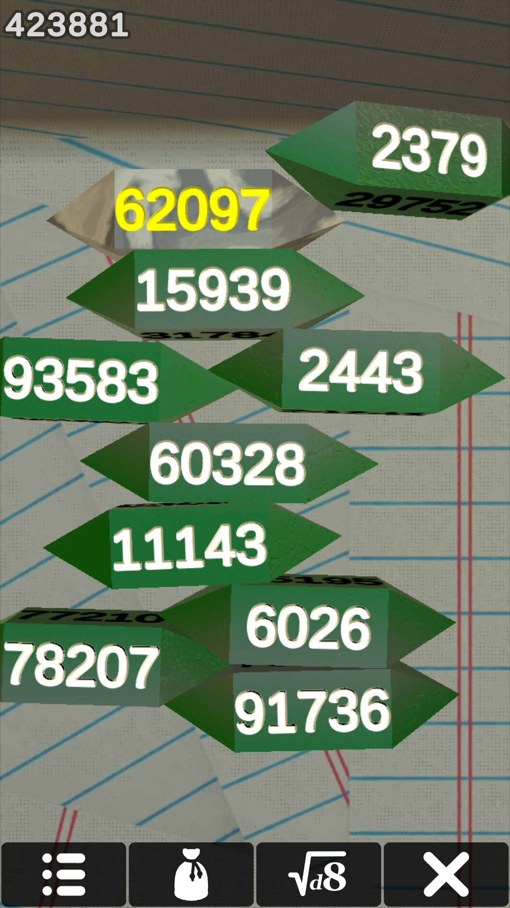

[Here is the dice bag xml file.](Grimoire.xml). I added suitable colours! Remember to check in the settings that perfect fairness is selected.

I didnt notice the dice roll history recorded all the individual values. Checking that would have made things a lot easier than noting them all down by hand :( Oh, well.

### Testing

I rolled 9 "normal" dice and 1 "guaranteed S+" die at a time, then noted the range (or "rarity") that each die roll fell into. I repeated throwing all 10 dice at once until at least one die rolled an "SR" (value under 2923). I then repeated this process for every set of rolls.

### The Value of Twilight Crystals

Since it's only possible to buy Crystals in packs, I needed to find the minimum that a hypothetical person could spend on a particular number of rolls, from a starting point of having none.

Taking the values from my app's current pricing, I divided the price of the pack by the number of total Crystals, which I then used to then find the optimal pack combination - the minimum you can spend for each number of 10 rolls.

This isn't useful for real world spending, since you don't know how many rolls you will need to make ahead of time. I wanted to be charitable, instead of calculating based on the simplest combination of packs. I did this all by hand, so it's certainly wrong.

## Data

### Valuing each pack

| Pack (T. Crys) | Cost (£) | Cost (£)/💎) | per 300💎 |
|---|---|---|---|
| x1153 | 74.99 | 0.0650 | 19.5117 |
| x831 | 54.99 | 0.0662 | 19.8520 |
| x533 | 39.99 | 0.0750 | 22.5084 |
| x317 | 23.99 | 0.0757 | 22.7034700315 |
| x148 (& item) | 11.99 | 0.0810 | 24.3041 |
| x61 | 4.99 | 0.0818 | 24.2505 |
_(Rounded to 4 places on chart; calculated from 10 places)_

### Best possible value for 10 rolls

| No. 10 rolls | 💎 | Best Pack Combo | Price (£) |
|---|---|---|
| 1 | 300 | x317 | 23.99 |
| 2 | 600 | 2(x317) | 47.98 |
| 3 | 900 | x831 + 2(x61) | 64.97 |
| 4 | 1200 | x1153 + x61 | 78.98 |
| 5 | 1500 | 2(x831) | 109.98 |
| 6 | 1800 | x1153 + x831 | 129.98 |
| 7 | 2100 | x1153 + x831 + 2(x61) | 139.97 |
| 8 | 2400 | 2(x1153) + 2(x61) | 157.96 |
| 9 | 2700 | 2(x1153) + 3(x148) | 185.55 |
| 10 | 3000 | 2(x1153) + 2(x317) + x61 | 202.95 |
| 11 | 3300 | x1153 + 2(x831) + x533 | 224.96 |

 

### Referenced game information
Transcripts OCRed then corrected by hand, so excuse any errors. Screenshots are included for double checking (with the top bar cropped out for obvious reasons).

**

Banner Information
**

Transcripts

1.
> June Featured Grimoire 
Period: 3 days left 
Drop Rates 
 SR 3% (135 type)
 S 20% (124 type)
 A 77% (44 type)
 Notes: -Drop rates are rounded to the third decimal place for each rarity. 
 -Drop rates for weapons and nightmares are rounded to the fourth decimal place. 
 -The rates provided may not add up to 100% from the digits displayed. 
 -Rounding or truncation to the fourth decimal place has been made to the actual percentage provided.
 -Grimoire results are performed based on the drop rates for each individual grimoire you summon. For this reason, summoning grimoires a certain number of times is not a guarantee that a given weapon or nightmare will appear. Additionally, you may obtain duplicates of the same weapon or nightmare. 

2.
> SR Weapon Appearance 
Gun of Masochism 0.666% [Rate Up] 
Great Axe of Bondage 0.666% [Rate Up]  
Fiddle of Delusion 0.007%  
Violin of Bondage 0.007%  
Ukulele of Curiosity 0.007%  
Guitar of Gluttony 0.007%  
Staff of Delusion 0.007%  

3.
> SR Nightmare Appearance  
Flon, Corpse Spear 0.666% [Rate Up] 
Ugallu 0.007% 
Noin, Sandstorm's Mandate 0.007% 
Karkinos 0.007% 
Elza, the Ancient Priestess 0.007% 
Red Rose 0.007% 
Ouroboros 0.007% 
Scarlet Diabolos 0.007% 
Barbarian 0.007% 
Griffon 0.007% 

4.
> S Weapon Appearance  
Hammer of Depravity 0.161% 
Tome of Dependence 0.161%  
Staff of Masochism 0.161%  
Sword of Misery 0.161%  
Wheel of Brutality 0.161%  
War Song's Echo 0.161%  
Slothful God's Harp 0.161%  
Harp of Collection 0.161% 

5.
> A Weapon Appearance 
Poet's Harp 1.604%  
Lovely Violin 1.604% 
Scepter of Power 1.604%  
Apprentice's Staff 1.604%  
Farmer's Bow 1.604% 
Calamitous Bow 1.604% 
Strongman's Hammer 1.604% 
Assassin's Kit 1.604%  
The Wolf's Offering 1.604%  
Dragon Scythe 1.604%  
Sword of Necessary Evil 1.604% 

6. 
> Drop Rates (when S or greater is guaranteed)
 SR 3% (135 type)
 S 97% (124 type) 
Notes: -Drop rates are rounded to the third decimal place for each rarity. 
-Drop rates for weapons and nightmares are rounded to the fourth decimal place.  
-The rates provided may not add up to 100% from the digits displayed. 
-Rounding or truncation to the fourth decimal place has been made to the actual percentage provided. 
-Grimoire results are performed based on the drop rates for each individual grimoire you summon. For this reason, summoning grimoires a certain number of times is not a guarantee that a given weapon or nightmare will appear. Additionally, you may obtain duplicates of the same weapon or nightmare.

7.
> SR Weapon Appearance 
Gun of Masochism 0.666% [Rate Up] 
Great Axe of Bondage 0.666% [Rate Up]  
Fiddle of Delusion 0.007%  
Violin of Bondage 0.007%  
Ukulele of Curiosity 0.007%  
Guitar of Gluttony 0.007%  
Staff of Delusion 0.007%  

8.
> SR Nightmare Appearance  
Flon, Corpse Spear 0.666% [Rate Up] 
Ugallu 0.007% 
Noin, Sandstorm's Mandate 0.007% 
Karkinos 0.007% 
Elza, the Ancient Priestess 0.007% 
Red Rose 0.007% 
Ouroboros 0.007% 
Scarlet Diabolos 0.007% 
Barbarian 0.007% 
Griffon 0.007% 

9.
> S Weapon Appearance 
Hammer of Depravity 0.782%  
Time of Dependence 0.782%   
Staff of Masochism 0.782% 
Sword of Misery 0.782%  
Wheel of Brutality 0.782%  
War Song's Echo 0.782% 
Slothful God's Harp 0.782%  
Harp of Collection 0.782% 

Screenshots

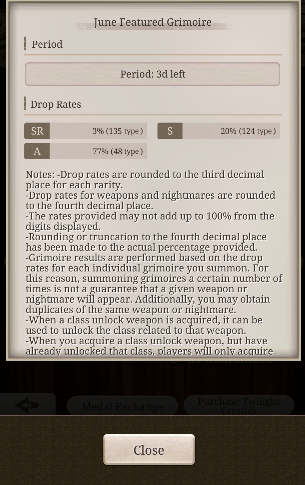 
 
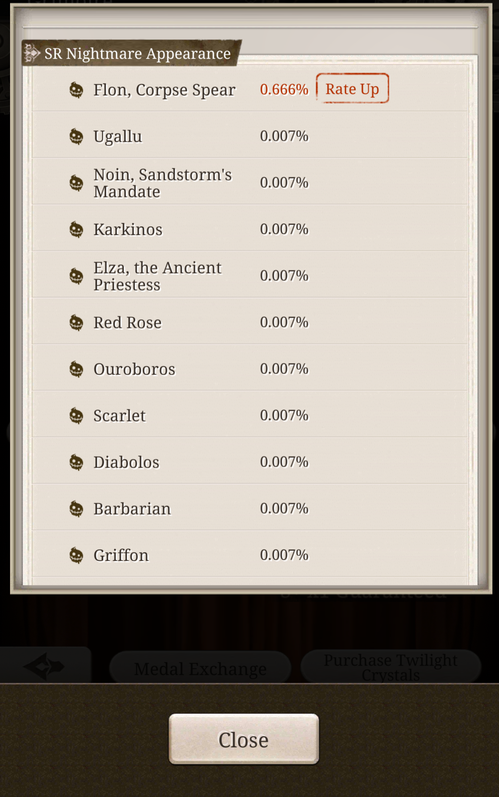 
 
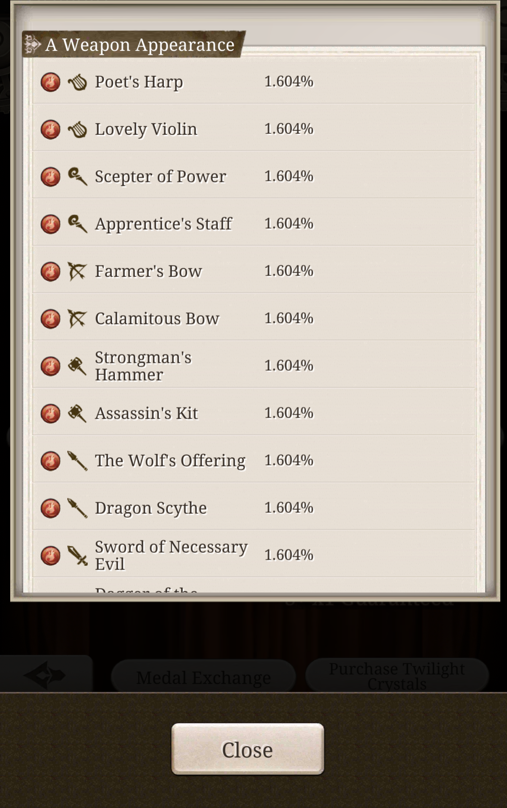 
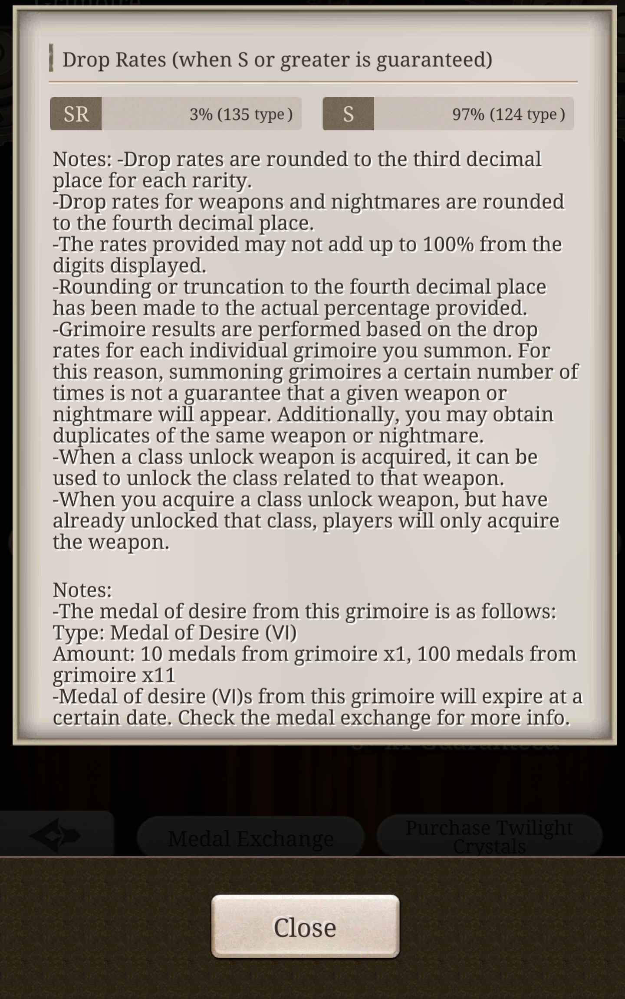 
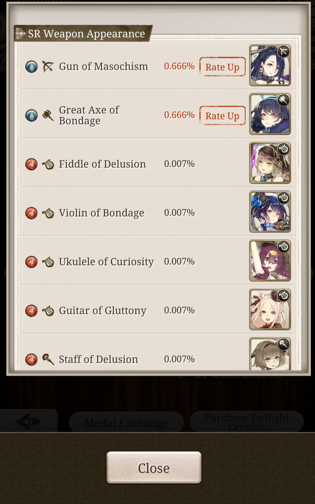 
 
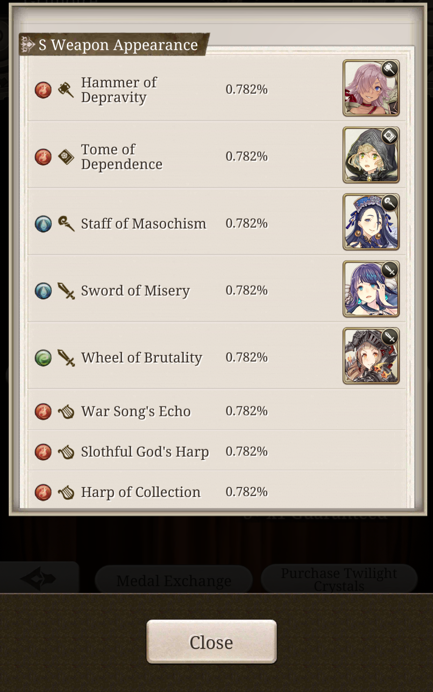

**

Twilight Crystal Packs
**

Transcripts

1.
> •12 Twilight Crystals £0.99  
12 Paid twilight crystals. 
•37 Twilight Crystals £2.99  
37 Paid twilight crystals.  
•61 Twilight Crystals £4.99,  
61 Paid twilight crystals.  
•T.Crys. x148 and +Gold Vial £11.99 
Paid T.Crys. x148, +Gold Vial x1

2.
> •T.Crys. x148 and +Drop Vial £11.99  
Paid T.Crys. x148, +Drop Vial x1  
•T.Crys. x148 and +EXP Vial £11.99  
Paid T.Crys. x148, +EXP Vial x1  
•Twilight Crystal x317 £23.99,  
Paid T.Crys. x306 (+11 free)  
•Twilight Crystal x533 £39.99  
Paid T.Crys. x502 (+31 free)

3.
> •Twilight Crystal x533 £39.99  
Paid T.Crys. x502 (+31 free)  
•Twilight Crystal x831 £54.99  
Paid T.Crys. x750 (+81 free)  
•Twilight Crystal x1,153 £74.99  
Paid T.Crys. x1,000 (+153 free)

Screenshots

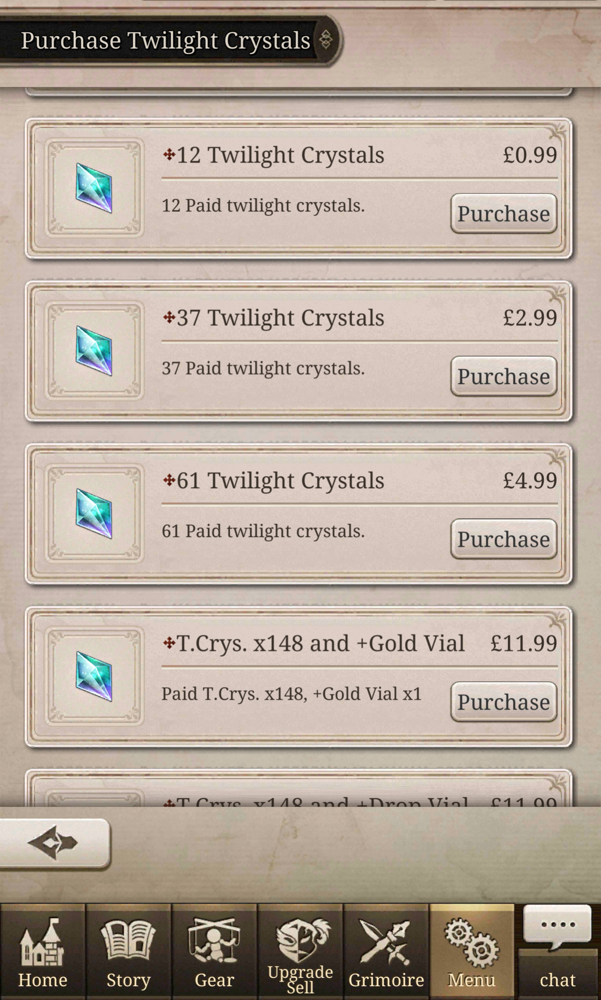 
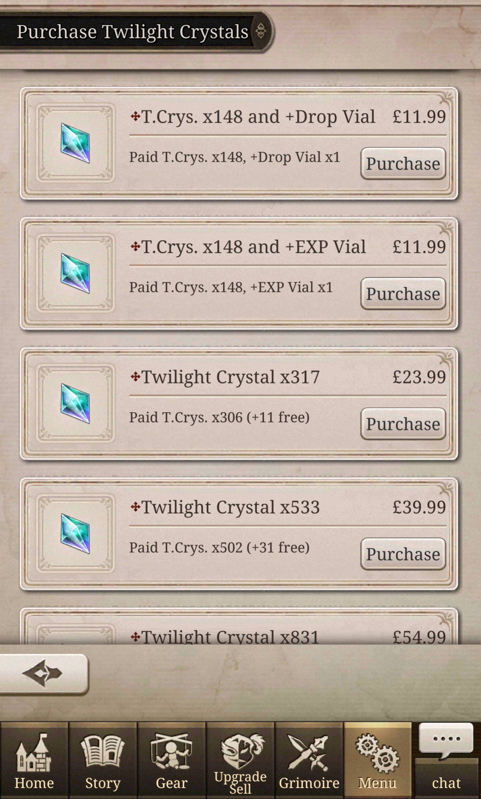 
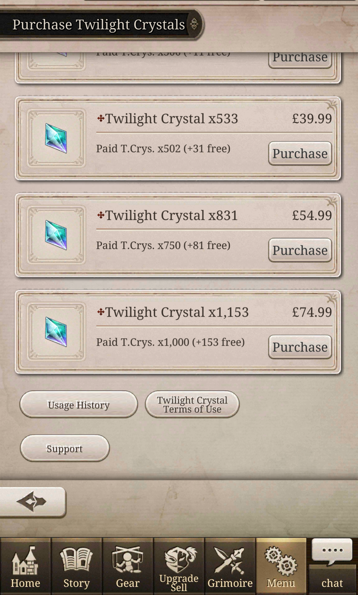 

### Rolls

Warning: this is gonna sound like ass to a screenreader. There's no way around it. If you don't know what this means, ignore it  
📜 = A 
📓 = S 
📒 = SR 
➕ = Featured SR 

**

Full Rolls
**

|Rolls 1 | Result |
|---|---|
| 1 | 📓📜📜📓📜📜📓📜📜📜 |
| 2 | 📜📜📓📜📜📒📓📓📜📜 |

 

| Rolls 2 | Result |
|---|---|
| 1 | 📒📓📜📜📜📜📓📜📜📜  |

 

| Rolls 3 | Result |
|---|---|
| 1 | 📜📜📜📜📜📜📜📜📜📓 |
| 2 | 📜📓📜📜📜📜📜📓📜📜 |
| 3 | 📜📜📓📜📓📜📓📜📜📜 |
| 4 | 📜📜📓📜📓📜📜📜📜📜 |
| 5 | 📓📓📜📓📜📜📜📜📜📜 |
| 6 | 📜📓📓📜📜📓📜📓📜📜 |
| 7 | 📜📜📜📜📜📓📜📜📜📜 |
| 8 | 📜📜📜📜📜📓📜📜📜📓 |
| 9 | 📜📜📜📜📓📓📜📜📜📜 |
| 10 | 📜📓📜📜📓📒📜📜📜📜 |

 

| Rolls 4 | Result |
|---|---|
| 1 | 📜📜📜📜📜📜📓📜📜📜 |
| 2 | 📜📓📜📜📜📓📜📓📜📓 |
| 3 | 📜📜📜📜📜📜📓📜📜📜 |
| 4 | 📓📓📜📜📜📜📓📓📜📜 |
| 5 | 📜➕📜📜📓📜📒📓📓📜 |

 

| Rolls 5 | Result |
|---|---|
| 1 | 📜📓📓📜📜📜📜📓📓📓 |
| 2 | 📜📜📜📜📜📓📓📜📓📜 |
| 3 | 📓📜📓📜📓📜📓📜📓📜 |
| 4 | 📜📓📓📜📜📜📓📜📜➕ |

 

| Rolls 6 | Result |
|---|---|
| 1 | 📓📜📜📓📜📓📜📜📜📓 |
| 2 | 📜📜📜📓📜📓📜📓📜📜 |
| 3 | ➕📜📜📓📜📜📜📓📜📜 |

 

| Rolls 7 | Result |
|---|---|
| 1 | 📜📜📜📜📓📜📓📓📜📓 |
| 2 | 📜📜📜📓📓📓📜📜📜📜 |
| 3 | 📜📜📓📜📓📜📒📜📜📜 |

 

| Rolls 8 | Result |
|---|---|
| 1 | 📜📜📜📓📜📓📜📓📜📜 |
| 2 | 📜📜📜📜📜📜📓📜📜📜 |
| 3 | 📜📜📜📓📜📜📜📜📜📓 |
| 4 | 📜📜📜📜📓📜📜📓📜📜 |
| 5 | 📜📜📓📜📓📓📓📜📜📜 |
| 6 | 📜📜📜📓📜📜📜📓📓📜 |
| 7 | 📜📜📜📜📜📜📓📜📜📜 |
| 8 | 📜📜📜📜📜📜📓📓📜📜 |
| 9 | 📜📜📜📓📜📓📓📜📜📜 |
| 10 | 📓📜📓📜📜📜📓📓📜📜 |
| 11 | 📜📓📜📜📜📜📜📒📜📜 |

 

| Rolls 9 | Result |
|---|---|
| 1 | 📜📓📜📒📜📓📜📓📜📜 |

 

| Rolls 10 | Result |
|---|---|
| 1 | 📜📜📜📜📜📜📜📜📓📜 |
| 2 | 📓📜📜📓📜📜📜📓📓📜 |
| 3 | 📜📜📜📜📜📜📜📜📜📓 |
| 4 | 📓📜📓📜📜📜📜📜📓📓 |
| 5 | 📜📜📜📜📓📜📜📜📓📓 |
| 6 | 📜📜📜📜📜📓📓📜📓📓 |
| 7 | 📜📜📜📓📜📜📜📜📜📜 |
| 8 | 📜📜📓📜📓📜📜📜📓📜 |
| 9 | 📓📓📓📜📜📜📜📜📓📜 |
| 10 | 📜📓📓📜📜📓📜📜📜📜 |
| 11 | 📜📓➕📜📜📓📓📜➕📜 |

